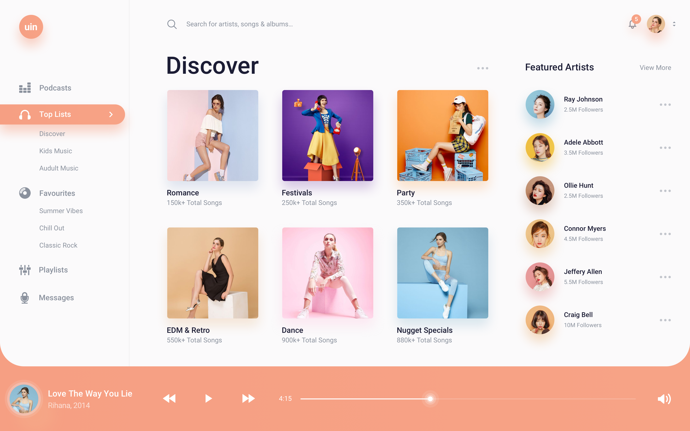

# Dashboard 02 (Music Player Interface)

The second in a series where I showcase how to take dashboard designs and implement them in React.

The design for this project shown below. This is a design taken off of [Dribbble](https://dribbble.com)
of a music player interface.

The preview for this project can be found [here](https://kwameopareasiedu.github.io/music-player-interface/)
